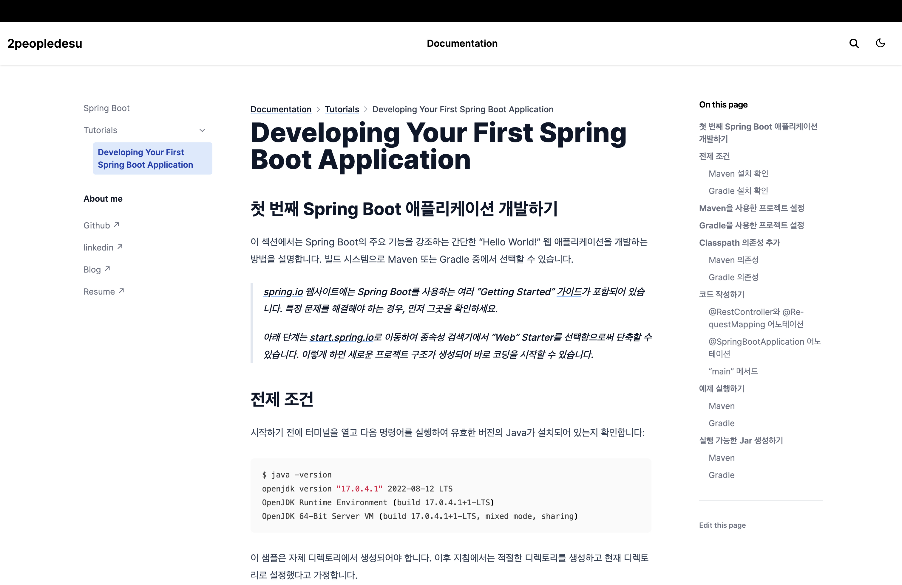

# Spring Reference Documentation 한국어 번역

  

## Introduce

Spring의 레퍼런스 문서를 한국어로 번역한 사이트입니다.

영어에 미숙하여 오역이 있을 수 있습니다. 오역 발견 시 아래 방법으로 제보해주시면 감사하겠습니다.

- [GitHub Issue](https://github.com/2peopledesu/docs-to-korean/issues)
- [이메일](mailto:2peopledesu@gmail.com)

## License

이 프로젝트는 Spring 공식 문서의 번역본으로, 원본과 동일한 라이선스를 따릅니다.