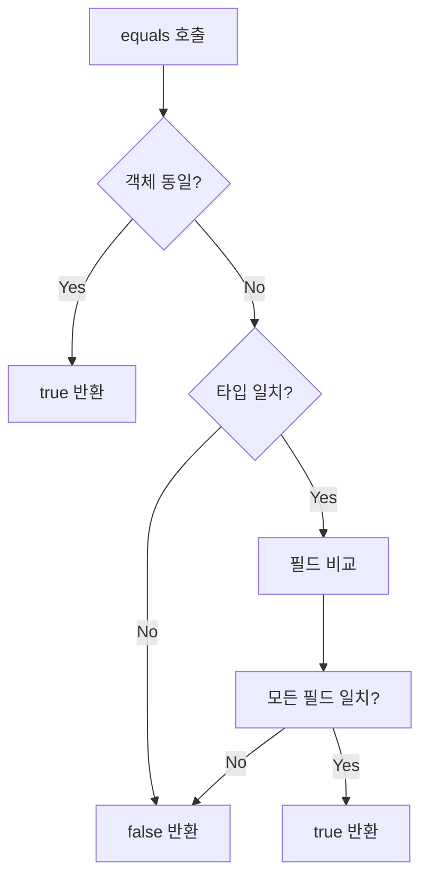

##  Methods Common to All Objects

### Item 10: equals를 재정의할 때는 일반 규약을 따르라

`equals` 메서드를 재정의하는 것은 간단해 보이지만, 잘못 구현하면 심각한 문제가 발생할 수 있습니다. 문제를 피하는 가장 쉬운 방법은 `equals`를 재정의하지 않는 것입니다. 다음 경우에 해당하면 재정의하지 않는 것이 좋습니다.

#### equals를 재정의하지 말아야 할 경우
1. **각 인스턴스가 본질적으로 고유함**  
   (예: `Thread` - 동작하는 개체를 표현하는 클래스)

2. **논리적 동등성 검사가 필요 없음**  
   (예: `java.util.regex.Pattern` - 정규표현식 일치 여부보다 객체 자체 비교 필요)

3. **상위 클래스의 equals가 적절히 동작함**  
   (예: 대부분의 `Set`, `List`, `Map` 구현체)

4. **클래스가 private/package-private이고 equals 호출 필요 없음**  
   ```java
   @Override 
   public boolean equals(Object o) {
       throw new AssertionError(); // 의도적으로 호출 방지
   }
   ```

---

#### equals를 재정의해야 할 경우
- **논리적 동등성**을 비교해야 할 때 (값 클래스: `Integer`, `String` 등)
- 객체 식별성(object identity)이 아닌 **값 비교**가 필요할 때
- Map의 키나 Set의 원소로 사용될 경우

> 📌 **Enum은 예외!**  
> 인스턴스 통제(Item 1)를 통해 유일성을 보장하므로 Object의 equals로 충분

---

### equals의 일반 규약

#### 1. 반사성 (Reflexivity)
- `x.equals(x)` → **항상 true**
- 모든 객체는 자신과 같아야 함

#### 2. 대칭성 (Symmetry)
- `x.equals(y)`가 true → `y.equals(x)`도 **반드시 true**
- **예제: 대소문자 구별 없는 문자열 클래스**
  ```java
  // 잘못된 구현 - 대칭성 위배
  class CaseInsensitiveString {
      private String s;
      
      @Override 
      public boolean equals(Object o) {
          if (o instanceof CaseInsensitiveString)
              return s.equalsIgnoreCase(((CaseInsensitiveString) o).s);
          if (o instanceof String) // 다른 타입과 비교 시 문제!
              return s.equalsIgnoreCase((String) o);
          return false;
      }
  }
  ```
  ```java
  // 올바른 구현
  @Override
  public boolean equals(Object o) {
      return o instanceof CaseInsensitiveString &&
          ((CaseInsensitiveString) o).s.equalsIgnoreCase(s);
  }
  ```

#### 3. 추이성 (Transitivity)
- `x.equals(y)`와 `y.equals(z)`가 true → `x.equals(z)`도 **반드시 true**
- **예제: 상속받은 클래스에서의 문제**
  ```java
  class Point {
      private final int x, y;
      // equals 구현: x,y 비교
  }

  class ColorPoint extends Point {
      private final Color color;
      
      // 잘못된 구현 - 추이성 위배
      @Override
      public boolean equals(Object o) {
          if (!(o instanceof Point)) return false;
          if (!(o instanceof ColorPoint)) // Point와 비교 시 color 무시
              return o.equals(this);
          return super.equals(o) && ((ColorPoint) o).color == color;
      }
  }
  ```
  - `ColorPoint(1,2, RED).equals(Point(1,2))` → true  
  - `Point(1,2).equals(ColorPoint(1,2, BLUE))` → true  
  - `ColorPoint(1,2, RED).equals(ColorPoint(1,2, BLUE))` → false (추이성 위배)

#### 4. 일관성 (Consistency)
- `x.equals(y)`는 **호출마다 일관된 결과** 반환
- **불변 객체**는 수명 내내 동일해야 함
- **예제: `java.net.URL`의 equals**
  - 네트워크 호출 결과에 의존 → 일관성 위배 가능성

#### 5. null-아님
- `x.equals(null)` → **항상 false**
- 묵시적 null 검사: `if (!(o instanceof MyType)) return false;`

---

### 올바른 equals 구현 방법
1. **== 연산자로 입력이 자기 자신인지 확인**  
   (성능 최적화용)

2. **instanceof 연산자로 타입 확인**  
   (묵시적 null 검사 포함)

3. **입력을 올바른 타입으로 형변환**

4. **핵심 필드 모두 검사**  
   (float/double은 `compare`, 나머지는 `==` 또는 `equals`)

**예제: PhoneNumber 클래스**
```java
public final class PhoneNumber {
    private final short areaCode, prefix, lineNum;
    @Override

    public boolean equals(Object o) {
        if (o == this) return true; // 1. 자기 참조 확인
        if (!(o instanceof PhoneNumber)) return false; // 2. 타입 확인
        PhoneNumber pn = (PhoneNumber) o; // 3. 형변환
        return pn.lineNum == lineNum // 4. 필드 비교
        && pn.prefix == prefix
        && pn.areaCode == areaCode;
    }
}
```
---


### 주의사항
- **equals 재정의 시 hashCode도 반드시 재정의** (Item 11)
- **필드 비교 순서가 성능에 영향** (다를 확률 높은 필드 먼저 비교)
- **AutoValue 프레임워크** 사용 시 자동 생성 가능 (권장)


## equals 메서드의 일반 규약 심화 분석

### 동치 관계(Equivalence Relation)란?
집합을 서로 같은 요소들로 구성된 부분집합(동치 클래스)으로 분할하는 연산입니다. 모든 요소가 동일한 클래스에 속하면 사용자 관점에서 상호 교환 가능합니다.

---

### 1. 대칭성(Symmetry) 위반 사례

**문제 코드: CaseInsensitiveString**
```java
// 문제: 대칭성 위반!
public final class CaseInsensitiveString {
    private final String s;

    @Override 
    public boolean equals(Object o) {
        if (o instanceof CaseInsensitiveString)
            return s.equalsIgnoreCase(((CaseInsensitiveString) o).s);
        if (o instanceof String) // String과의 비교 시도
            return s.equalsIgnoreCase((String) o);
        return false;
    }
}
```

**테스트 시나리오**
```java
CaseInsensitiveString cis = new CaseInsensitiveString("Polish");
String s = "polish";

System.out.println(cis.equals(s)); // true (CaseInsensitiveString → String 비교)
System.out.println(s.equals(cis)); // false (String의 equals는 대소문자 구분)
```

**발생 문제**
컬렉션 동작 예측 불가
```java
List<CaseInsensitiveString> list = new ArrayList<>();
list.add(cis);

System.out.println(list.contains(s)); // JDK 구현에 따라 다른 결과!
```

**해결 방법**
```java
@Override
public boolean equals(Object o) {
    // 동일 타입만 비교
    return o instanceof CaseInsensitiveString &&
        ((CaseInsensitiveString) o).s.equalsIgnoreCase(s);
}
```

---

### 2. 추이성(Transitivity) 위반 사례

**기본 클래스: Point**
```java
public class Point {
    private final int x, y;
    
    @Override
    public boolean equals(Object o) {
        if (!(o instanceof Point)) return false;
        Point p = (Point) o;
        return p.x == x && p.y == y;
    }
}
```

**확장 클래스: ColorPoint (잘못된 구현)**
```java
public class ColorPoint extends Point {
    private final Color color;
    
    // 잘못된 equals 구현
    @Override
    public boolean equals(Object o) {
        if (!(o instanceof Point)) return false;
        
        // Point 타입이면 color 무시
        if (!(o instanceof ColorPoint))
            return o.equals(this);
            
        return super.equals(o) && ((ColorPoint) o).color == color;
    }
}
```

**테스트 시나리오**
```java
ColorPoint cp1 = new ColorPoint(1, 2, Color.RED);
Point p = new Point(1, 2);
ColorPoint cp2 = new ColorPoint(1, 2, Color.BLUE);

System.out.println(p.equals(cp1)); // true (Point의 equals 사용)
System.out.println(cp1.equals(p)); // true (ColorPoint의 equals)
System.out.println(p.equals(cp2)); // true (Point의 equals)
System.out.println(cp1.equals(cp2)); // false (color 비교)
```

**추이성 위반 구조**
```
cp1 ↔ p ↔ cp2 (모두 true)
cp1 ↔ cp2 (false)
```

---

### 3. 올바른 상속 처리 방법
**원칙: 상속보다 컴포지션 사용**
```java
public class ColorPoint {
    private final Point point;
    private final Color color;
    
    public ColorPoint(int x, int y, Color color) {
        point = new Point(x, y);
        this.color = color;
    }
    
    @Override
    public boolean equals(Object o) {
        if (!(o instanceof ColorPoint)) return false;
        ColorPoint cp = (ColorPoint) o;
        return cp.point.equals(point) && cp.color.equals(color);
    }
}
```

**핵심 전략:**
- 상속 대신 포함 관계 사용
- 상위 클래스와 하위 클래스의 equals 논리 분리
- 타입 체크를 엄격하게 수행

---

### 주의해야 할 추가 사항

1. **일관성(Consistency)**
   - 외부 자원에 의존하지 말 것!
   - 예: `java.net.URL`의 equals
   ```java
   URL url1 = new URL("https://example.com");
   URL url2 = new URL("https://example.com");

   // 네트워크 상태에 따라 결과가 달라질 수 있음
   System.out.println(url1.equals(url2)); 
   ```

2. **Null 검사**
   - 묵시적 null 검사 활용
   ```java
   @Override
   public boolean equals(Object o) {
       // instanceof 연산자가 자동으로 null 체크
       if (!(o instanceof MyType)) return false;
       ...
   }
   ```

---

## equals 구현 체크리스트

| 단계 | 내용 | 예시 코드 |
|------|------|-----------|
| 1    | == 연산자로 자기 참조 확인 | `if (o == this) return true;` |
| 2    | instanceof로 타입 검사 | `if (!(o instanceof PhoneNumber)) return false;` |
| 3    | 정확한 타입으로 형변환 | `PhoneNumber pn = (PhoneNumber) o;` |
| 4    | 핵심 필드 비교 | `return areaCode == pn.areaCode && ...;` |



## equals 메서드 구현에 대한 문제점과 해결책

`equals` 메서드를 구현할 때, `Point` 클래스를 상속받은 `ColorPoint` 클래스에서 색상 정보를 무시하는 것은 바람직하지 않습니다. 만약 `equals` 메서드를 아예 생략하면, `Point`의 구현이 상속되어 색상 정보가 무시된 채 비교가 이루어집니다. 이는 `equals` 계약을 위반하지는 않지만, 명백히 수용할 수 없는 상황입니다.

### 잘못된 equals 메서드 예시
아래의 `equals` 메서드는 색상 정보를 비교할 때 문제가 발생합니다:
```java
// 잘못된 구현 - 대칭성 위반!
@Override 
public boolean equals(Object o) {
    if (!(o instanceof ColorPoint))
        return false;
    return super.equals(o) && ((ColorPoint) o).color == color;
}
```

이 메서드의 문제는 `Point`와 `ColorPoint`를 비교할 때 서로 다른 결과를 반환할 수 있다는 점입니다. 예를 들어:
```java
Point p = new Point(1, 2);
ColorPoint cp = new ColorPoint(1, 2, Color.RED);
```
- `p.equals(cp)`는 `true`를 반환하지만,
- `cp.equals(p)`는 `false`를 반환합니다.

### 대칭성 위반 해결 시도
대칭성을 해결하기 위해 `ColorPoint`의 `equals` 메서드를 수정할 수 있습니다:
```java
// 잘못된 구현 - 추이성 위반!
@Override 
public boolean equals(Object o) {
    if (!(o instanceof Point))
        return false;
    // o가 일반 Point인 경우 색상 무시
    if (!(o instanceof ColorPoint))
        return o.equals(this);
    // o가 ColorPoint인 경우 전체 비교
    return super.equals(o) && ((ColorPoint) o).color == color;
}
```

이 접근 방식은 대칭성을 제공하지만, 추이성을 위반합니다. 예를 들어:
```java
ColorPoint p1 = new ColorPoint(1, 2, Color.RED);
Point p2 = new Point(1, 2);
ColorPoint p3 = new ColorPoint(1, 2, Color.BLUE);
```
- `p1.equals(p2)`와 `p2.equals(p3)`는 `true`를 반환하지만,
- `p1.equals(p3)`는 `false`를 반환합니다. 이는 명백한 추이성 위반입니다.

### 무한 재귀 문제
이 접근 방식은 무한 재귀를 초래할 수 있습니다. 예를 들어, `ColorPoint`와 `SmellPoint`라는 두 개의 `Point` 하위 클래스가 각각 이와 같은 `equals` 메서드를 가지고 있다면, `myColorPoint.equals(mySmellPoint)` 호출 시 `StackOverflowError`가 발생할 수 있습니다.

### 해결책
이 문제는 객체 지향 언어에서 동치 관계의 근본적인 문제입니다. 값 구성 요소를 추가하면서 `equals` 계약을 유지하는 방법은 없습니다. 

일부는 `instanceof` 대신 `getClass` 테스트를 사용하여 `equals` 메서드를 구현할 수 있다고 주장합니다:
```java
// 잘못된 구현 - 리스코프 치환 원칙 위반
@Override 
public boolean equals(Object o) {
    if (o == null || o.getClass() != getClass())
        return false;
    Point p = (Point) o;
    return p.x == x && p.y == y;
}
```

이 방법은 객체가 동일한 구현 클래스를 가질 때만 동등하다고 판단합니다. 이는 문제가 될 수 있습니다. `Point`의 하위 클래스 인스턴스는 여전히 `Point`이며, `Point`로서 기능해야 하지만, 이 접근 방식으로 인해 실패하게 됩니다.

### 예시: 단위 원에 있는지 확인하는 메서드
단위 원에 있는지 확인하는 메서드를 작성할 수 있습니다:
```java
// 단위 원에 있는 모든 Point를 포함하는 집합 초기화
private static final Set<Point> unitCircle = Set.of(
        new Point(1, 0), new Point(0, 1),
        new Point(-1, 0), new Point(0, -1));

public static boolean onUnitCircle(Point p) {
    return unitCircle.contains(p);
}
```

이 방법은 가장 빠른 구현 방식은 아닐 수 있지만, 잘 작동합니다. 만약 `Point`를 확장하여 값 구성 요소를 추가하지 않는 단순한 방법으로 구현한다면, 예를 들어 인스턴스 수를 추적하는 생성자를 가진 `CounterPoint` 클래스를 만들 수 있습니다:
```java
public class CounterPoint extends Point {
    private static final AtomicInteger counter = new AtomicInteger();
    
    public CounterPoint(int x, int y) {
        super(x, y);
        counter.incrementAndGet();
    }
    
    public static int numberCreated() { return counter.get(); }
}
```

## 리스코프 치환 원칙과 값 구성 요소 추가

리스코프 치환 원칙(Liskov Substitution Principle)은 타입의 모든 중요한 속성이 그 하위 타입에서도 유지되어야 하며, 타입을 위해 작성된 모든 메서드는 그 하위 타입에서도 동일하게 작동해야 한다고 말합니다 [Liskov87]. 이는 `Point`의 하위 클래스(예: `CounterPoint`)가 여전히 `Point`이며, `Point`로서 기능해야 한다는 이전 주장을 공식적으로 설명합니다.

### CounterPoint와 onUnitCircle 메서드
만약 `CounterPoint`를 `onUnitCircle` 메서드에 전달하면, `Point` 클래스가 `getClass` 기반의 `equals` 메서드를 사용한다면, `onUnitCircle` 메서드는 `CounterPoint` 인스턴스의 x와 y 좌표에 관계없이 `false`를 반환합니다. 이는 대부분의 컬렉션(예: `onUnitCircle` 메서드에서 사용하는 `HashSet`)이 포함 여부를 테스트하기 위해 `equals` 메서드를 사용하기 때문입니다. 따라서 어떤 `CounterPoint` 인스턴스도 어떤 `Point`와도 같지 않게 됩니다.

하지만, 만약 `Point`에서 적절한 `instanceof` 기반의 `equals` 메서드를 사용한다면, 같은 `onUnitCircle` 메서드는 `CounterPoint` 인스턴스에 대해서도 잘 작동합니다.

### 값 구성 요소 추가를 위한 대안
인스턴스화 가능한 클래스를 확장하고 값 구성 요소를 추가하는 만족스러운 방법은 없지만, 좋은 해결책이 있습니다: **상속보다 구성(composition)을 선호하라**는 아이템 18의 조언을 따르는 것입니다. `ColorPoint`가 `Point`를 확장하는 대신, `ColorPoint`에 private `Point` 필드를 두고, 이 색상 점과 동일한 위치에 있는 점을 반환하는 공개 메서드를 제공합니다.

```java
// equals 계약을 위반하지 않고 값 구성 요소 추가
public class ColorPoint {
    private final Point point;
    private final Color color;

    public ColorPoint(int x, int y, Color color) {
        point = new Point(x, y);
        this.color = Objects.requireNonNull(color);
    }

    /**
     * 이 색상 점의 점 뷰를 반환합니다.
     */
    public Point asPoint() { return point; }

    @Override 
    public boolean equals(Object o) {
        if (!(o instanceof ColorPoint))
            return false;
        ColorPoint cp = (ColorPoint) o;
        return cp.point.equals(point) && cp.color.equals(color);
    }
    // ... 나머지 생략
}
```

### Timestamp 클래스의 문제점
Java 플랫폼 라이브러리에는 인스턴스화 가능한 클래스를 확장하고 값 구성 요소를 추가하는 클래스가 몇 가지 있습니다. 예를 들어, `java.sql.Timestamp`는 `java.util.Date`를 확장하고 나노초 필드를 추가합니다. `Timestamp`의 `equals` 구현은 대칭성을 위반하며, `Timestamp`와 `Date` 객체가 동일한 컬렉션에서 사용되거나 혼합될 경우 불규칙한 동작을 초래할 수 있습니다. `Timestamp` 클래스는 날짜와 타임스탬프를 혼합하지 말라는 경고 문구를 포함하고 있습니다. 이들을 분리하여 사용하면 문제가 발생하지 않지만, 혼합할 경우 발생하는 오류는 디버깅하기 어려울 수 있습니다. `Timestamp` 클래스의 이러한 동작은 실수였으며, 이를 모방해서는 안 됩니다.

## equals 계약의 요구 사항

### 값 구성 요소 추가
추상 클래스의 하위 클래스에 값 구성 요소를 추가하는 것은 `equals` 계약을 위반하지 않습니다. 이는 "태그 클래스보다 클래스 계층 구조를 선호하라"는 아이템 23의 조언을 따를 때 중요한 사항입니다. 예를 들어, 다음과 같은 구조를 가질 수 있습니다:

- **추상 클래스**: `Shape` (값 구성 요소 없음)
- **하위 클래스**: `Circle` (반지름 필드 추가)
- **하위 클래스**: `Rectangle` (길이와 너비 필드 추가)

이러한 구조에서는 슈퍼클래스 인스턴스를 직접 생성할 수 없기 때문에 앞서 언급한 문제들이 발생하지 않습니다. 즉, 하위 클래스가 추가적인 값을 가질 수 있지만, 상위 클래스의 계약을 위반하지 않도록 설계할 수 있습니다.

### 일관성
`equals` 계약의 네 번째 요구 사항은 두 객체가 같다면, 하나(또는 둘 다)가 수정되지 않는 한 항상 같아야 한다는 것입니다. 이는 다음과 같은 의미를 가집니다:

- **가변 객체**: 시간에 따라 서로 다른 객체와 같을 수 있습니다.
- **불변 객체**: 항상 같은 객체와 같아야 하며, 다른 객체와는 같지 않아야 합니다.

클래스를 작성할 때, 해당 클래스가 불변이어야 하는지 신중하게 고려해야 합니다(아이템 17). 만약 불변이어야 한다고 결론지으면, `equals` 메서드가 같은 객체는 항상 같고, 다른 객체는 항상 다르도록 강제하는지 확인해야 합니다. 이를 통해 객체의 일관성을 유지할 수 있습니다.

### 신뢰할 수 없는 자원에 의존하지 않기
클래스가 불변인지 여부와 관계없이, 신뢰할 수 없는 자원에 의존하는 `equals` 메서드를 작성하지 마십시오. 이 금지를 위반하면 일관성 요구 사항을 충족하기 매우 어렵습니다. 예를 들어, `java.net.URL`의 `equals` 메서드는 URL과 관련된 호스트의 IP 주소 비교에 의존합니다. 호스트 이름을 IP 주소로 변환하는 데는 네트워크 접근이 필요할 수 있으며, 시간이 지남에 따라 동일한 결과를 보장하지 않습니다. 이로 인해 URL의 `equals` 메서드가 `equals` 계약을 위반할 수 있으며, 실제로 문제가 발생했습니다.

URL의 `equals` 메서드 동작은 큰 실수였으며, 이를 모방해서는 안 됩니다. 불행히도, 호환성 요구 사항으로 인해 이 동작은 변경할 수 없습니다. 이러한 문제를 피하기 위해 `equals` 메서드는 메모리에 상주하는 객체에 대해 결정론적인 계산만 수행해야 합니다.

### non-nullity
마지막 요구 사항은 공식적인 이름이 없으므로 "non-nullity"이라고 부르겠습니다. 이는 모든 객체가 null과 같지 않아야 한다는 것입니다. `o.equals(null)` 호출에 대해 우연히 `true`를 반환하는 것은 상상하기 어렵지만, `NullPointerException`을 우연히 발생시키는 것은 어렵지 않습니다. 일반 계약은 이를 금지합니다.

많은 클래스는 null에 대한 명시적 테스트로 이를 방지하는 `equals` 메서드를 가지고 있습니다:
```java
@Override 
public boolean equals(Object o) {
    if (o == null)
        return false;
    ...
}
```
이 테스트는 불필요합니다. `equals` 메서드는 인수의 동등성을 테스트하기 위해 먼저 인수를 적절한 타입으로 캐스팅해야 하며, 이를 통해 접근자를 호출하거나 필드에 접근할 수 있습니다. 캐스팅을 수행하기 전에, 메서드는 `instanceof` 연산자를 사용하여 인수가 올바른 타입인지 확인해야 합니다:
```java
@Override 
public boolean equals(Object o) {
    if (!(o instanceof MyType))
        return false;
    MyType mt = (MyType) o;
    ...
}
```

이러한 방식으로 `equals` 메서드를 구현하면, 객체의 동등성을 올바르게 판단할 수 있으며, 계약을 준수하는 안전한 코드를 작성할 수 있습니다.


## 고품질 equals 메서드 작성법

`equals` 메서드를 작성할 때, 다음과 같은 절차를 따르면 고품질의 메서드를 만들 수 있습니다:

### 1. 자기 참조 확인
`==` 연산자를 사용하여 인수가 현재 객체를 참조하는지 확인합니다. 만약 그렇다면 `true`를 반환합니다. 이는 성능 최적화를 위한 방법으로, 비교가 비용이 많이 드는 경우에는 특히 유용합니다.

### 2. 타입 확인
`instanceof` 연산자를 사용하여 인수가 올바른 타입인지 확인합니다. 만약 올바르지 않다면 `false`를 반환합니다. 일반적으로 올바른 타입은 메서드가 정의된 클래스입니다. 때때로, 이 클래스가 구현한 인터페이스일 수도 있습니다. 인터페이스를 사용하면, 이 클래스가 인터페이스를 구현하여 클래스 간 비교를 허용하는 `equals` 계약을 세분화할 수 있습니다. `Set`, `List`, `Map`, `Map.Entry`와 같은 컬렉션 인터페이스가 이러한 특성을 가집니다.

### 3. 타입 캐스팅
인수를 올바른 타입으로 캐스팅합니다. 이 캐스팅은 `instanceof` 테스트가 선행되었기 때문에 성공할 것이 보장됩니다.

### 4. 필드 비교
클래스의 각 "중요한" 필드에 대해, 해당 필드의 인스턴스와 현재 객체의 필드가 일치하는지 확인합니다. 모든 테스트가 성공하면 `true`를 반환하고, 그렇지 않으면 `false`를 반환합니다. 만약 2단계에서 타입이 인터페이스라면, 인수의 필드에 접근할 때 인터페이스 메서드를 사용해야 합니다. 타입이 클래스인 경우, 접근성에 따라 필드에 직접 접근할 수 있습니다.

- **기본 필드**: `float` 또는 `double`이 아닌 경우 `==` 연산자를 사용하여 비교합니다.
- **객체 참조 필드**: `equals` 메서드를 재귀적으로 호출합니다.
- **float 필드**: `Float.compare(float, float)` 메서드를 사용합니다.
- **double 필드**: `Double.compare(double, double)` 메서드를 사용합니다.

`float`와 `double` 필드에 대한 특별한 처리는 `Float.NaN`, `-0.0f` 및 유사한 `double` 값의 존재로 인해 필요합니다. `Float.equals` 및 `Double.equals`를 사용하여 비교할 수 있지만, 이는 매번 오토박싱을 수반하므로 성능이 저하됩니다.

### 배열 필드
배열 필드의 경우, 각 요소에 대해 위의 지침을 적용합니다. 배열 필드의 모든 요소가 중요하다면, `Arrays.equals` 메서드 중 하나를 사용합니다.

### null 필드 처리
일부 객체 참조 필드는 합법적으로 null을 포함할 수 있습니다. `NullPointerException`의 가능성을 피하기 위해, 이러한 필드의 동등성을 확인할 때는 `Objects.equals(Object, Object)` 정적 메서드를 사용합니다.

### 복잡한 필드 비교
일부 클래스(예: `CaseInsensitiveString`)의 경우, 필드 비교가 단순한 동등성 테스트보다 복잡할 수 있습니다. 이 경우, 필드를 정규화된 형태로 저장하여 `equals` 메서드가 비표준 비교보다 저렴한 정확한 비교를 수행할 수 있도록 할 수 있습니다. 이 기법은 불변 클래스에 가장 적합합니다(아이템 17). 객체가 변경될 수 있는 경우, 정규화된 형태를 최신 상태로 유지해야 합니다.

### 성능 최적화
`equals` 메서드의 성능은 필드를 비교하는 순서에 따라 영향을 받을 수 있습니다. 최상의 성능을 위해, 먼저 다를 가능성이 높거나 비교 비용이 적은 필드를 비교해야 합니다. 객체의 논리적 상태와 관련이 없는 필드(예: 동기화 작업에 사용되는 잠금 필드)는 비교할 필요가 없습니다. "중요한 필드"로부터 계산할 수 있는 파생 필드는 비교할 필요가 없지만, 이를 비교하면 `equals` 메서드의 성능을 향상시킬 수 있습니다. 예를 들어, `Polygon` 클래스가 있고 면적을 캐시하는 경우, 두 다각형의 면적이 다르면 가장자리와 정점을 비교할 필요가 없습니다.

## equals 메서드 작성 후 점검 사항

`equals` 메서드를 작성한 후, 다음 세 가지 질문을 스스로에게 해보세요: 
- 대칭성(symmetric)이 있는가?
- 추이성(transitive)이 있는가?
- 일관성(consistent)이 있는가?

이 질문에 대한 답변을 스스로 확인하는 것뿐만 아니라, 단위 테스트를 작성하여 검증하는 것이 중요합니다. 만약 AutoValue를 사용하여 `equals` 메서드를 생성했다면, 테스트를 생략해도 안전합니다. 만약 속성이 유지되지 않는다면, 그 이유를 파악하고 `equals` 메서드를 수정해야 합니다. 물론 `equals` 메서드는 반사성(reflexivity)과 비-널성(non-nullity) 요구 사항도 충족해야 하지만, 이 두 가지는 일반적으로 자연스럽게 해결됩니다.

### 예시: PhoneNumber 클래스
다음은 위의 절차에 따라 작성된 간단한 `PhoneNumber` 클래스의 `equals` 메서드입니다:
```java
public final class PhoneNumber {
    private final short areaCode, prefix, lineNum;

    public PhoneNumber(int areaCode, int prefix, int lineNum) {
        this.areaCode = rangeCheck(areaCode, 999, "area code");
        this.prefix   = rangeCheck(prefix,   999, "prefix");
        this.lineNum  = rangeCheck(lineNum, 9999, "line num");
    }

    private static short rangeCheck(int val, int max, String arg) {
        if (val < 0 || val > max)
            throw new IllegalArgumentException(arg + ": " + val);
        return (short) val;
    }

    @Override 
    public boolean equals(Object o) {
        if (o == this) return true; // 자기 참조 확인
        if (!(o instanceof PhoneNumber)) return false; // 타입 확인
        PhoneNumber pn = (PhoneNumber)o; // 타입 캐스팅
        return pn.lineNum == lineNum && pn.prefix == prefix && pn.areaCode == areaCode; // 필드 비교
    }
    // ... 나머지 생략
}
```

### 주의 사항
- **hashCode 메서드도 반드시 재정의**: `equals`를 재정의할 때는 항상 `hashCode`도 재정의해야 합니다 (아이템 11).
- **너무 복잡하게 만들지 말 것**: 필드의 동등성만 테스트하면 `equals` 계약을 준수하기 어렵지 않습니다. 지나치게 복잡한 동등성 비교는 문제를 일으킬 수 있습니다. 예를 들어, `File` 클래스는 동일한 파일을 참조하는 심볼릭 링크를 비교하지 않아야 합니다.
- **Object 타입을 사용해야 함**: `equals` 메서드의 매개변수 타입을 `Object`가 아닌 다른 타입으로 지정하지 마십시오. 예를 들어, 다음과 같은 메서드는 잘못된 것입니다:
    ```java
    // 잘못된 구현 - 매개변수 타입은 Object여야 함!
    public boolean equals(MyClass o) {
        ...
    }
    ```
    이 메서드는 `Object.equals`를 재정의하지 않고 오버로드하게 되며, 이는 문제가 될 수 있습니다. `Override` 주석을 일관되게 사용하면 이러한 실수를 방지할 수 있습니다.

### AutoValue 사용
`equals` 및 `hashCode` 메서드를 작성하고 테스트하는 것은 번거롭고 지루한 작업입니다. Google의 오픈 소스 AutoValue 프레임워크를 사용하면 이러한 메서드를 자동으로 생성할 수 있습니다. 클래스에 단일 주석을 추가하는 것만으로도 가능합니다. 대부분의 경우, AutoValue가 생성하는 메서드는 사용자가 직접 작성하는 것과 본질적으로 동일합니다.

IDE에서도 `equals` 및 `hashCode` 메서드를 생성하는 기능이 있지만, 생성된 소스 코드는 AutoValue를 사용하는 코드보다 더 장황하고 가독성이 떨어지며, 클래스의 변경 사항을 자동으로 추적하지 않기 때문에 테스트가 필요합니다. 그럼에도 불구하고 IDE에서 `equals` 및 `hashCode` 메서드를 생성하는 것이 수동으로 구현하는 것보다 일반적으로 바람직합니다. IDE는 부주의한 실수를 하지 않기 때문입니다.

### 결론
`equals` 메서드를 재정의해야 할 필요가 없다면, Object에서 상속된 구현이 원하는 대로 작동할 수 있습니다. 만약 `equals`를 재정의한다면, 클래스의 모든 중요한 필드를 비교하고, `equals` 계약의 다섯 가지 조항을 모두 준수하는 방식으로 비교해야 합니다.

## Item 11: equals를 재정의할 때는 항상 hashCode도 재정의하라

`equals`를 재정의하는 모든 클래스는 반드시 `hashCode`도 재정의해야 합니다. 이를 소홀히 하면, `hashCode`의 일반 계약을 위반하게 되어 `HashMap`이나 `HashSet`과 같은 컬렉션에서 제대로 작동하지 않을 수 있습니다. 다음은 `Object` 사양에서 수정된 계약 내용입니다:

- **일관성**: 애플리케이션 실행 중 객체에 대해 `hashCode` 메서드를 반복적으로 호출할 때, `equals` 비교에 사용되는 정보가 수정되지 않는 한 항상 동일한 값을 반환해야 합니다. 이 값은 애플리케이션의 실행 간에 일관될 필요는 없습니다.
  
- **동등한 객체**: 두 객체가 `equals(Object)` 메서드에 따라 동등하다면, 두 객체의 `hashCode`를 호출했을 때 동일한 정수 결과를 반환해야 합니다.

- **부등한 객체**: 두 객체가 `equals(Object)` 메서드에 따라 다르다면, 각 객체의 `hashCode`가 반드시 서로 다른 결과를 반환할 필요는 없습니다. 그러나 부등한 객체에 대해 서로 다른 결과를 생성하면 해시 테이블의 성능이 향상될 수 있습니다.

가장 중요한 조항은 `hashCode`를 재정의하지 않으면 위반되는 두 번째 조항입니다: 동등한 객체는 동일한 해시 코드를 가져야 합니다. 두 개의 서로 다른 인스턴스가 클래스의 `equals` 메서드에 따라 논리적으로 동등할 수 있지만, `Object`의 `hashCode` 메서드에 따르면 이들은 공통점이 없는 두 객체로 간주됩니다. 따라서 `Object`의 `hashCode` 메서드는 두 개의 무작위 숫자를 반환하게 됩니다.

### 예시: PhoneNumber 클래스

`PhoneNumber` 클래스를 `HashMap`의 키로 사용하려고 할 때 발생할 수 있는 문제를 살펴보겠습니다:

```java
Map<PhoneNumber, String> m = new HashMap<>();
m.put(new PhoneNumber(707, 867, 5309), "Jenny");
```


이 시점에서 `m.get(new PhoneNumber(707, 867, 5309))`가 "Jenny"를 반환할 것이라고 기대할 수 있지만, 실제로는 `null`을 반환합니다. 이는 두 개의 `PhoneNumber` 인스턴스가 관련되어 있기 때문입니다: 하나는 `HashMap`에 삽입되었고, 다른 하나는 (시도된) 검색에 사용됩니다. `PhoneNumber` 클래스가 `hashCode`를 재정의하지 않으면 두 개의 동등한 인스턴스가 서로 다른 해시 코드를 가지게 되어 `hashCode` 계약을 위반하게 됩니다. 따라서 `get` 메서드는 `put` 메서드에 의해 저장된 해시 버킷과 다른 버킷에서 전화번호를 찾으려 할 것입니다. 두 인스턴스가 우연히 같은 버킷에 해시될 경우에도, `get` 메서드는 거의 확실히 `null`을 반환할 것입니다. 이는 `HashMap`이 각 항목과 관련된 해시 코드를 캐시하고 해시 코드가 일치하지 않으면 객체 동등성을 확인하지 않기 때문입니다.

이 문제를 해결하는 것은 `PhoneNumber`에 적절한 `hashCode` 메서드를 작성하는 것으로 간단합니다. 좋은 `hashCode` 메서드는 다음과 같은 특징을 가져야 합니다:

- **나쁜 예시**: 항상 같은 해시 코드를 반환하는 구현은 다음과 같습니다:
  
  ```java
  @Override 
  public int hashCode() { return 42; }
  ```

  이 구현은 법적으로는 유효하지만, 모든 객체가 동일한 해시 코드를 가지게 되어 해시 테이블이 연결 리스트로 전락하게 만듭니다. 이로 인해 선형 시간에 실행되어야 할 프로그램이 이차 시간에 실행되게 됩니다.

- **좋은 해시 함수**: 좋은 해시 함수는 서로 다른 인스턴스에 대해 서로 다른 해시 코드를 생성하는 경향이 있습니다. 이상적으로는 해시 함수가 모든 정수 값에 대해 불균형적으로 분포되어야 합니다. 이를 달성하는 것은 어려울 수 있지만, 공정한 근사치를 얻는 것은 그리 어렵지 않습니다.

### 해시 코드 작성 방법

1. **결과 변수 선언**: `result`라는 int 변수를 선언하고, 객체의 첫 번째 중요한 필드에 대한 해시 코드로 초기화합니다.
  
2. **나머지 필드 처리**: 객체의 나머지 중요한 필드에 대해 다음을 수행합니다:
   - 필드가 기본 타입인 경우, `Type.hashCode(f)`를 사용하여 해시 코드를 계산합니다.
   - 필드가 객체 참조인 경우, 해당 클래스의 `equals` 메서드가 필드를 재귀적으로 비교하는 경우 `hashCode`를 재귀적으로 호출합니다. 더 복잡한 비교가 필요한 경우, 필드의 "표준 표현"을 계산하고 그에 대해 `hashCode`를 호출합니다. 필드 값이 null인 경우, 0(또는 다른 상수)을 사용합니다.
   - 필드가 배열인 경우, 각 중요한 요소를 별도의 필드로 처리합니다. 즉, 각 중요한 요소에 대해 위의 규칙을 재귀적으로 적용하고, 결과를 결합합니다. 배열에 중요한 요소가 없으면 상수를 사용합니다. 모든 요소가 중요하다면 `Arrays.hashCode`를 사용합니다.

3. **결과 결합**: 2단계에서 계산한 해시 코드를 `result`에 다음과 같이 결합합니다: `result = 31 * result + c;`

4. **결과 반환**: 최종적으로 `result`를 반환합니다.

이러한 방법을 통해 `hashCode` 메서드를 올바르게 구현할 수 있습니다.

## 해시 코드 메서드 작성 후 점검 사항

해시 코드 메서드를 작성한 후, 동등한 인스턴스가 동일한 해시 코드를 가지는지 확인해야 합니다. 이를 검증하기 위해 단위 테스트를 작성하는 것이 좋습니다. (AutoValue를 사용하여 `equals`와 `hashCode` 메서드를 생성한 경우, 이러한 테스트는 생략할 수 있습니다.) 만약 동등한 인스턴스가 서로 다른 해시 코드를 가진다면, 그 이유를 파악하고 문제를 해결해야 합니다.

### 해시 코드 계산 시 유의사항

- **파생 필드 제외**: 해시 코드 계산에서 파생 필드는 제외할 수 있습니다. 즉, 다른 필드에서 계산할 수 있는 값은 무시해야 합니다. `equals` 비교에 사용되지 않는 필드도 제외해야 하며, 그렇지 않으면 `hashCode` 계약의 두 번째 조항을 위반할 수 있습니다.

- **필드 순서의 중요성**: 2.b 단계에서의 곱셈은 필드의 순서에 따라 결과가 달라지므로, 유사한 필드가 여러 개 있는 클래스에서 더 나은 해시 함수를 생성합니다. 예를 들어, 문자열 해시 함수에서 곱셈이 생략되면 모든 애너그램이 동일한 해시 코드를 가지게 됩니다. 31이라는 값은 홀수 소수로 선택되었습니다. 만약 짝수였다면 곱셈이 오버플로우될 경우 정보가 손실될 수 있습니다. 소수를 사용하는 이점은 명확하지 않지만, 전통적으로 사용됩니다. 31의 좋은 점은 곱셈을 시프트와 뺄셈으로 대체할 수 있어 일부 아키텍처에서 성능이 향상된다는 것입니다: `(31 `times i = (i << 5) - i`). 현대 JVM은 이러한 최적화를 자동으로 수행합니다.

### PhoneNumber 클래스의 해시 코드 예시

다음은 PhoneNumber 클래스에 대한 전형적인 해시 코드 메서드입니다:

```java
@Override 
public int hashCode() {
    int result = Short.hashCode(areaCode);
    result = 31 * result + Short.hashCode(prefix);
    result = 31 * result + Short.hashCode(lineNum);
    return result;
}
```

이 메서드는 PhoneNumber 인스턴스의 세 가지 중요한 필드만을 입력으로 사용하여 간단하고 결정론적인 계산 결과를 반환합니다. 따라서 동등한 PhoneNumber 인스턴스는 동일한 해시 코드를 가지게 됩니다. 이 메서드는 Java 플랫폼 라이브러리의 해시 코드 구현과 동등한 수준으로, 간단하고 빠르며 서로 다른 전화번호를 다양한 해시 버킷에 잘 분산시킵니다.

### 해시 함수의 성능

이 아이템에서 제시된 레시피는 적절한 해시 함수를 생성하지만, 최신 기술에 비해 최첨단은 아닙니다. Java 플랫폼 라이브러리의 값 타입에서 발견되는 해시 함수와 유사한 품질을 제공하며, 대부분의 용도에 적합합니다. 만약 충돌 가능성이 적은 해시 함수가 필요하다면, Guava의 `com.google.common.hash.Hashing`을 참조하세요.

### Objects 클래스의 해시 메서드

`Objects` 클래스에는 임의의 개수의 객체를 받아 해시 코드를 반환하는 정적 메서드가 있습니다. 이 메서드인 `hash`를 사용하면, 이 아이템의 레시피에 따라 작성된 해시 코드 메서드와 유사한 품질의 한 줄짜리 해시 코드 메서드를 작성할 수 있습니다. 그러나 이 메서드는 배열 생성을 포함하고, 원시 타입의 인수가 있을 경우 박싱과 언박싱이 필요하므로 성능이 떨어집니다. 이러한 스타일의 해시 함수는 성능이 중요하지 않은 상황에서만 사용하는 것이 좋습니다.

다음은 이 기술을 사용하여 작성된 PhoneNumber의 해시 함수 예시입니다:

```java
@Override 
public int hashCode() {
    return Objects.hash(lineNum, prefix, areaCode);
}
```

### 불변 클래스의 해시 코드 캐싱

클래스가 불변이고 해시 코드 계산 비용이 상당하다면, 매번 해시 코드를 재계산하는 대신 객체에 해시 코드를 캐싱하는 것을 고려할 수 있습니다. 이 유형의 객체가 대부분 해시 키로 사용될 것이라고 생각된다면, 인스턴스가 생성될 때 해시 코드를 계산해야 합니다. 그렇지 않다면, 해시 코드가 처음 호출될 때 지연 초기화하는 방법을 선택할 수 있습니다. 지연 초기화 필드가 있는 경우 클래스가 스레드 안전성을 유지하도록 주의해야 합니다 (아이템 83). 우리의 PhoneNumber 클래스는 이러한 처리가 필요하지 않지만, 방법을 보여주기 위해 다음과 같이 작성할 수 있습니다. 해시 코드 필드의 초기 값(이 경우 0)은 일반적으로 생성된 인스턴스의 해시 코드가 아니어야 합니다:

```java
private int hashCode; // 자동으로 0으로 초기화됨

@Override 
public int hashCode() {
    int result = hashCode;
    if (result == 0) {
        result = Short.hashCode(areaCode);
        result = 31 * result + Short.hashCode(prefix);
        result = 31 * result + Short.hashCode(lineNum);
        hashCode = result;
    }
    return result;
}
```

## 해시 코드 메서드 작성 시 유의사항

해시 코드 계산에서 중요한 필드를 제외하여 성능을 개선하려는 유혹에 빠지지 마십시오. 비록 결과적인 해시 함수가 더 빠르게 실행될 수 있지만, 품질이 떨어져 해시 테이블의 성능이 저하될 수 있습니다. 특히, 해시 함수가 무시한 영역에서 주로 차이가 나는 많은 인스턴스가 있을 경우, 이들 인스턴스는 몇 개의 해시 코드로 매핑될 것입니다. 이로 인해 선형 시간에 실행되어야 할 프로그램이 이차 시간에 실행될 수 있습니다.

이 문제는 단순한 이론적 문제가 아닙니다. Java 2 이전에는 문자열 해시 함수가 문자열의 첫 번째 문자부터 시작하여 최대 16개의 문자를 고르게 선택하여 사용했습니다. URL과 같은 대규모 계층적 이름의 경우, 이 함수는 앞서 설명한 병목 현상을 정확히 나타냈습니다.

### 해시 코드 반환 값의 세부 사항

해시 코드가 반환하는 값에 대한 세부 사양을 제공하지 마십시오. 이렇게 하면 클라이언트가 그 값에 의존할 수 없게 되어, 향후 변경이 용이해집니다. Java 라이브러리의 많은 클래스(예: String, Integer)는 인스턴스 값에 따라 `hashCode` 메서드가 반환하는 정확한 값을 명시합니다. 이는 좋지 않은 아이디어이며, 우리가 감수해야 하는 실수입니다. 이러한 명시는 향후 해시 함수를 개선하는 능력을 방해합니다. 세부 사항을 명시하지 않으면 해시 함수에서 결함이 발견되거나 더 나은 해시 함수가 발견되었을 때, 이를 다음 릴리스에서 변경할 수 있습니다.

### 결론

`equals`를 재정의할 때마다 `hashCode`도 반드시 재정의해야 합니다. 그렇지 않으면 프로그램이 올바르게 실행되지 않을 것입니다. `hashCode` 메서드는 `Object`에서 지정한 일반 계약을 준수해야 하며, 불균형한 인스턴스에 대해 합리적으로 다른 해시 코드를 할당해야 합니다. 이는 페이지 51의 레시피를 사용하면 쉽게 달성할 수 있습니다. 아이템 10에서 언급했듯이, AutoValue 프레임워크는 `equals`와 `hashCode` 메서드를 수동으로 작성하는 좋은 대안을 제공하며, IDE에서도 이러한 기능을 일부 제공합니다.

## Item 12: 항상 toString을 재정의하라

`Object` 클래스는 기본적인 `toString` 메서드를 제공하지만, 이 메서드가 반환하는 문자열은 일반적으로 사용자가 원하는 형식이 아닙니다. 기본 구현은 클래스 이름과 해시 코드의 16진수 표현을 포함하여, 예를 들어 `PhoneNumber@163b91`과 같은 형식입니다. `toString`의 일반 계약은 "간결하지만 유용한 표현으로, 사람이 읽기 쉬워야 한다"고 명시하고 있습니다. 따라서 `PhoneNumber@163b91`은 간결할 수 있지만, `707-867-5309`와 비교했을 때 정보가 부족합니다.

### toString의 중요성

- `toString` 메서드는 `println`, `printf`, 문자열 연결 연산자, assert, 디버거에서 자동으로 호출됩니다. 따라서 객체를 직접 호출하지 않더라도 다른 코드에서 호출될 수 있습니다.
- 유용한 `toString` 구현을 제공하면 디버깅이 쉬워지고, 시스템의 사용성이 향상됩니다. 예를 들어, 다음과 같이 유용한 진단 메시지를 생성할 수 있습니다:
  ```java
  System.out.println("Failed to connect to " + phoneNumber);
  ```

### 출력 형식

- `toString` 메서드는 객체의 흥미로운 모든 정보를 반환해야 하며, 객체가 크거나 문자열 표현이 적합하지 않은 상태를 포함할 경우 요약 정보를 반환해야 합니다. 예를 들어, "Manhattan residential phone directory (1487536 listings)"와 같은 형식이 적절합니다.
- `toString`의 반환 값 형식을 문서화하는 것이 좋습니다. 이는 값 클래스(예: 전화번호, 행렬)에서 유용하며, 표준화된 인간이 읽을 수 있는 표현을 제공합니다. 이 표현은 입력 및 출력, CSV 파일과 같은 지속적인 데이터 객체에 사용될 수 있습니다.

### 형식 지정의 장단점

- **장점**: 형식을 지정하면 객체와 문자열 표현 간의 변환이 용이해집니다. Java 플랫폼 라이브러리의 많은 값 클래스(예: `BigInteger`, `BigDecimal`)가 이 방식을 따릅니다.
- **단점**: 형식을 지정하면 이후에 변경할 수 없게 됩니다. 사용자가 이 형식에 맞춰 코드를 작성할 것이므로, 형식을 변경하면 기존 코드와 데이터가 깨질 수 있습니다. 따라서 형식을 지정하지 않으면 향후 개선의 유연성을 유지할 수 있습니다.

`toString` 메서드를 재정의하는 것은 클래스의 사용성을 높이고, 디버깅을 용이하게 하며, 시스템의 전반적인 품질을 향상시키는 데 기여합니다.

## toString 메서드의 형식 지정 및 문서화

형식을 지정할지 여부에 관계없이, 의도를 명확하게 문서화해야 합니다. 형식을 지정하기로 결정한 경우, 이를 정확하게 명시해야 합니다. 예를 들어, `PhoneNumber` 클래스에 대한 `toString` 메서드는 다음과 같이 작성할 수 있습니다:

```java
/**
 * 이 전화번호의 문자열 표현을 반환합니다.
 * 문자열은 "XXX-YYY-ZZZZ" 형식의 12자로 구성되며,
 * 여기서 XXX는 지역 코드, YYY는 접두사, ZZZZ는
 * 라인 번호입니다. 각 대문자는 하나의 십진수를 나타냅니다.
 *
 * 전화번호의 세 부분 중 어느 하나라도 필드를 채우기에
 * 너무 작으면, 필드는 선행 0으로 채워집니다.
 * 예를 들어, 라인 번호의 값이 123인 경우,
 * 문자열 표현의 마지막 네 문자는 "0123"이 됩니다.
 */
@Override 
public String toString() {
    return String.format("%03d-%03d-%04d", areaCode, prefix, lineNum);
}
```

형식을 지정하지 않기로 결정한 경우, 문서 주석은 다음과 같이 작성할 수 있습니다:

```java
/**
 * 이 포션에 대한 간단한 설명을 반환합니다.
 * 표현의 정확한 세부 사항은 명시되지 않으며 변경될 수 있습니다.
 * 그러나 다음은 전형적인 예로 간주될 수 있습니다:
 *
 * "[Potion #9: type=love, smell=turpentine, look=india ink]"
 */
@Override 
public String toString() { 
    // 구현 내용 
}
```

이 주석을 읽은 프로그래머는 형식의 세부 사항에 의존하는 코드를 작성할 경우, 형식이 변경되더라도 자신에게 책임이 있음을 알게 됩니다.

### 정보 접근 제공

형식을 지정하든 하지 않든, `toString`이 반환하는 정보에 대한 프로그래밍적 접근을 제공해야 합니다. 예를 들어, `PhoneNumber` 클래스는 지역 코드, 접두사 및 라인 번호에 대한 접근자를 포함해야 합니다. 이를 제공하지 않으면, 필요한 정보를 얻기 위해 프로그래머가 문자열을 파싱해야 하며, 이는 성능을 저하시킬 뿐만 아니라 불필요한 작업을 초래하고 오류가 발생하기 쉬운 시스템을 만듭니다. 접근자를 제공하지 않으면 문자열 형식이 사실상 API가 되어, 변경될 수 있다고 명시했더라도 문제가 발생할 수 있습니다.

### toString 메서드 작성 시 유의사항

- 정적 유틸리티 클래스에서는 `toString` 메서드를 작성하는 것이 의미가 없습니다.
- 대부분의 열거형(enum) 타입에서도 `toString` 메서드를 작성할 필요가 없습니다. Java는 이미 적절한 구현을 제공합니다.
- 그러나 공통 문자열 표현을 공유하는 하위 클래스가 있는 추상 클래스에서는 `toString` 메서드를 작성해야 합니다. 예를 들어, 대부분의 컬렉션 구현에서 `toString` 메서드는 추상 컬렉션 클래스에서 상속됩니다.

Google의 오픈 소스 AutoValue 기능은 `toString` 메서드를 자동으로 생성해 주며, 대부분의 IDE에서도 이 기능을 제공합니다. 이러한 메서드는 각 필드의 내용을 알려주지만, 클래스의 의미에 특화되어 있지 않습니다. 예를 들어, 전화번호는 표준 문자열 표현이 있으므로 자동 생성된 `toString` 메서드를 사용하는 것은 부적절하지만, 포션 클래스에는 적합합니다. 자동 생성된 `toString` 메서드는 `Object`에서 상속된 메서드보다 훨씬 나은 선택입니다.

### 결론

모든 인스턴스화 가능한 클래스에서 `Object`의 `toString` 구현을 재정의해야 합니다. 상위 클래스가 이미 이를 수행하지 않았다면 더욱 그렇습니다. 이는 클래스를 훨씬 더 사용하기 쉽게 만들고 디버깅을 돕습니다. `toString` 메서드는 객체에 대한 간결하고 유용한 설명을 반환해야 하며, 미적으로도 만족스러운 형식이어야 합니다.

## 아이템 13: clone 메서드는 신중하게 재정의하라

`Cloneable` 인터페이스는 클래스가 클로닝을 허용한다는 것을 알리기 위한 믹스인 인터페이스로 설계되었습니다. 그러나 이 인터페이스는 여러 가지 결함이 있어 그 목적을 제대로 수행하지 못합니다. 가장 큰 결함은 클론 메서드가 없고, `Object`의 클론 메서드가 protected로 설정되어 있다는 점입니다. 따라서 `Cloneable`을 구현한다고 해서 객체에서 클론을 직접 호출할 수는 없습니다. 리플렉션을 사용하지 않는 한, 클론 메서드를 호출할 수 있는 보장이 없습니다. 이러한 결함에도 불구하고 클론 기능은 널리 사용되고 있으므로, 이를 이해하는 것이 중요합니다. 이 아이템에서는 잘 작동하는 클론 메서드를 구현하는 방법, 클론을 재정의할 적절한 시점, 그리고 대안에 대해 설명합니다.

### Cloneable의 역할

`Cloneable` 인터페이스는 메서드를 포함하지 않지만, `Object`의 protected 클론 구현의 동작을 결정합니다. 클래스가 `Cloneable`을 구현하면, `Object`의 클론 메서드는 객체의 필드별 복사본을 반환하고, 그렇지 않으면 `CloneNotSupportedException`을 던집니다. 이는 인터페이스의 비정상적인 사용 사례로, 일반적으로 인터페이스를 구현하는 것은 클래스가 클라이언트에게 제공할 수 있는 기능을 나타냅니다. 그러나 이 경우에는 상위 클래스의 protected 메서드의 동작을 수정합니다.

### 클론 메서드의 일반 계약

클론 메서드의 일반 계약은 약합니다. 다음은 `Object` 사양에서 복사한 내용입니다:

- 이 객체의 복사본을 생성하고 반환합니다. "복사"의 정확한 의미는 객체의 클래스에 따라 달라질 수 있습니다.
- 일반적인 의도는, 객체 `(x)`에 대해 `(x.clone() neq x)`가 참이고, `(x.clone().getClass() == x.getClass())`가 참이어야 한다는 것입니다. 그러나 이는 절대적인 요구 사항은 아닙니다.
- 일반적으로 `(x.clone().equals(x))`가 참이지만, 이것도 절대적인 요구 사항은 아닙니다.
- 관례적으로, 이 메서드가 반환하는 객체는 `super.clone`을 호출하여 얻어야 합니다. 클래스와 모든 상위 클래스가 이 관례를 준수하면 `(x.clone().getClass() == x.getClass())`가 성립합니다.
- 반환된 객체는 클론된 객체와 독립적이어야 합니다. 이 독립성을 달성하기 위해, 반환된 객체의 하나 이상의 필드를 수정해야 할 수도 있습니다.

이 메커니즘은 생성자 체인과 유사하지만, 강제되지 않습니다. 만약 클래스의 클론 메서드가 `super.clone`을 호출하지 않고 생성자를 호출하여 인스턴스를 반환하면, 컴파일러는 경고하지 않지만, 해당 클래스의 서브클래스가 `super.clone`을 호출하면 잘못된 클래스의 객체가 생성되어 서브클래스의 클론 메서드가 제대로 작동하지 않을 수 있습니다. 만약 클론을 재정의하는 클래스가 final이라면, 이 관례는 무시해도 안전합니다. 그러나 final 클래스의 클론 메서드가 `super.clone`을 호출하지 않으면, 해당 클래스가 `Cloneable`을 구현할 이유가 없습니다. 이는 `Object`의 클론 구현의 동작에 의존하지 않기 때문입니다.

### Cloneable 구현 시 주의사항

클래스의 슈퍼클래스가 잘 작동하는 클론 메서드를 제공하는 경우, `Cloneable`을 구현하려면 먼저 `super.clone`을 호출해야 합니다. 이렇게 하면 원본의 완전한 복제본을 얻을 수 있습니다. 클래스에 선언된 필드는 원본과 동일한 값을 가지게 됩니다. 모든 필드가 기본값이나 불변 객체에 대한 참조를 포함하는 경우, 반환된 객체가 필요한 형태일 수 있으며, 이 경우 추가 처리가 필요하지 않습니다. 예를 들어, 아이템 11의 `PhoneNumber` 클래스가 이에 해당합니다. 그러나 불변 클래스는 클론 메서드를 제공해서는 안 됩니다. 이는 불필요한 복사를 유도할 수 있기 때문입니다.

### PhoneNumber 클래스의 클론 메서드 예시

다음은 `PhoneNumber` 클래스의 클론 메서드 예시입니다:

```java
@Override 
public PhoneNumber clone() {
    try {
        return (PhoneNumber) super.clone();
    } catch (CloneNotSupportedException e) {
        throw new AssertionError();  // 발생할 수 없음
    }
}
```

이 메서드가 작동하려면 `PhoneNumber` 클래스 선언을 수정하여 `Cloneable`을 구현해야 합니다. `Object`의 클론 메서드는 `Object`를 반환하지만, 이 클론 메서드는 `PhoneNumber`를 반환합니다. 이는 Java가 공변 반환 타입을 지원하기 때문에 합법적이고 바람직합니다. 즉, 오버라이딩 메서드의 반환 타입은 오버라이드된 메서드의 반환 타입의 서브클래스가 될 수 있습니다. 이는 클라이언트에서 캐스팅할 필요를 없애줍니다. `super.clone`의 결과를 `Object`에서 `PhoneNumber`로 캐스팅해야 하지만, 이 캐스트는 성공할 것이 보장됩니다.

클론 메서드의 호출은 try-catch 블록에 포함되어 있습니다. 이는 `Object`가 클론 메서드에서 `CloneNotSupportedException`을 던지도록 선언했기 때문입니다. `PhoneNumber`가 `Cloneable`을 구현하므로, `super.clone` 호출이 성공할 것임을 알 수 있습니다. 이 보일러플레이트 코드의 필요성은 `CloneNotSupportedException`이 unchecked 예외여야 했음을 나타냅니다 (아이템 71).

### 가변 객체를 참조하는 필드가 있는 경우

객체가 가변 객체를 참조하는 필드를 포함하는 경우, 앞서 보여준 간단한 클론 구현은 재앙적일 수 있습니다. 예를 들어, 아이템 7의 `Stack` 클래스는 다음과 같습니다:

```java
public class Stack {
    private Object[] elements;
    private int size = 0;
    private static final int DEFAULT_INITIAL_CAPACITY = 16;

    public Stack() {
        this.elements = new Object[DEFAULT_INITIAL_CAPACITY];
    }

    public void push(Object e) {
        ensureCapacity();
        elements[size++] = e;
    }

    public Object pop() {
        if (size == 0)
            throw new EmptyStackException();
        Object result = elements[--size];
        elements[size] = null; // 오래된 참조 제거
        return result;
    }

    // 최소한 하나의 요소를 위한 공간 확보
    private void ensureCapacity() {
        if (elements.length == size)
            elements = Arrays.copyOf(elements, 2 * size + 1);
    }
}
```

이 클래스의 클론 메서드를 구현할 때는 가변 객체를 참조하는 필드에 대한 처리를 신중하게 고려해야 합니다.

### Cloneable 구현 시 가변 상태 처리

클래스를 클론 가능하게 만들고자 할 때, 단순히 `super.clone()`을 호출하면 문제가 발생할 수 있습니다. 예를 들어, `Stack` 클래스의 클론 메서드가 `super.clone()`만 반환하면, 결과로 생성된 `Stack` 인스턴스는 올바른 `size` 필드 값을 가지지만, `elements` 필드는 원본 `Stack` 인스턴스와 동일한 배열을 참조하게 됩니다. 원본을 수정하면 클론의 불변성이 파괴되고, 그 반대의 경우도 마찬가지입니다. 이로 인해 프로그램이 비논리적인 결과를 생성하거나 `NullPointerException`을 발생시킬 수 있습니다.

이러한 상황은 `Stack` 클래스의 유일한 생성자를 호출함으로써 발생할 수 없습니다. 클론 메서드는 생성자처럼 작동하므로, 원본 객체에 해를 끼치지 않도록 하고 클론의 불변성을 올바르게 설정해야 합니다. `Stack`의 클론 메서드가 제대로 작동하려면 스택의 내부를 복사해야 합니다. 이를 가장 쉽게 수행하는 방법은 `elements` 배열에 대해 재귀적으로 클론을 호출하는 것입니다.

### Stack 클래스의 클론 메서드 예시

```java
@Override 
public Stack clone() {
    try {
        Stack result = (Stack) super.clone();
        result.elements = elements.clone(); // 배열을 재귀적으로 클론
        return result;
    } catch (CloneNotSupportedException e) {
        throw new AssertionError(); // 발생할 수 없음
    }
}
```

여기서 `elements.clone()`의 결과를 `Object[]`로 캐스팅할 필요는 없습니다. 배열에 대해 `clone`을 호출하면, 반환된 배열의 런타임 및 컴파일 타임 타입이 클론되는 배열과 동일합니다. 이는 배열을 복제하는 데 선호되는 방법입니다. 사실, 배열은 클론 기능을 사용하는 유일한 주요 용도입니다.

### final 필드와 Cloneable

`elements` 필드가 `final`이라면, 클론 메서드에서 새로운 값을 할당할 수 없기 때문에 이전의 해결책은 작동하지 않습니다. 이는 근본적인 문제입니다. 직렬화와 마찬가지로, `Cloneable` 아키텍처는 가변 객체를 참조하는 `final` 필드의 일반적인 사용과 호환되지 않습니다. 따라서 클론 가능하게 만들기 위해 일부 필드에서 `final` 수식어를 제거해야 할 수도 있습니다.

### 복잡한 구조의 클론 메서드

단순히 재귀적으로 클론을 호출하는 것만으로는 충분하지 않을 수 있습니다. 예를 들어, 해시 테이블의 클론 메서드를 작성한다고 가정해 보겠습니다. 이 해시 테이블의 내부는 키-값 쌍의 연결 리스트를 참조하는 각 버킷의 배열로 구성됩니다. 성능을 위해, 이 클래스는 내부적으로 `java.util.LinkedList` 대신 자체 경량 단일 연결 리스트를 구현합니다.

```java
public class HashTable implements Cloneable {
    private Entry[] buckets = ...; 

    private static class Entry {
        final Object key;
        Object value;
        Entry next;

        Entry(Object key, Object value, Entry next) {
            this.key = key;
            this.value = value;
            this.next = next;
        }
    }
    // ... 나머지 생략
}
```

단순히 버킷 배열을 재귀적으로 클론하면 다음과 같은 문제가 발생합니다:

```java
@Override 
public HashTable clone() {
    try {
        HashTable result = (HashTable) super.clone();
        result.buckets = buckets.clone(); // 잘못된 클론 메서드 - 공유 가변 상태 발생!
        return result;
    } catch (CloneNotSupportedException e) {
        throw new AssertionError(); // 발생할 수 없음
    }
}
```

이 경우, 각 버킷의 연결 리스트는 여전히 원본 해시 테이블의 연결 리스트를 참조하게 되어, 원본과 클론 간에 가변 상태가 공유됩니다. 따라서 클론 메서드를 구현할 때는 이러한 점을 반드시 고려해야 합니다.

### 복잡한 가변 상태를 가진 클래스의 클론 메서드 구현

클론 메서드가 자체 버킷 배열을 가지고 있더라도, 이 배열은 원본과 동일한 연결 리스트를 참조하게 되어, 클론과 원본 모두에서 비결정론적 행동을 초래할 수 있습니다. 이 문제를 해결하려면 각 버킷을 구성하는 연결 리스트를 복사해야 합니다. 다음은 일반적인 접근 방식입니다:

### HashTable 클래스의 클론 메서드 예시

```java
public class HashTable implements Cloneable {
    private Entry[] buckets = ...;

    private static class Entry {
        final Object key;
        Object value;
        Entry next;

        Entry(Object key, Object value, Entry next) {
            this.key = key;
            this.value = value;
            this.next = next;
        }

        // 이 Entry가 시작하는 연결 리스트를 재귀적으로 복사
        Entry deepCopy() {
            return new Entry(key, value,
                next == null ? null : next.deepCopy());
        }
    }

    @Override 
    public HashTable clone() {
        try {
            HashTable result = (HashTable) super.clone();
            result.buckets = new Entry[buckets.length];
            for (int i = 0; i < buckets.length; i++)
                if (buckets[i] != null)
                    result.buckets[i] = buckets[i].deepCopy();
            return result;
        } catch (CloneNotSupportedException e) {
            throw new AssertionError(); // 발생할 수 없음
        }
    }
    // ... 나머지 생략
}
```

위의 예시에서 `HashTable.Entry` 클래스는 "깊은 복사" 메서드를 지원하도록 확장되었습니다. `HashTable`의 클론 메서드는 적절한 크기의 새로운 버킷 배열을 할당하고, 원본 버킷 배열을 반복하여 각 비어 있지 않은 버킷을 깊은 복사합니다. `Entry`의 `deepCopy` 메서드는 연결 리스트 전체를 복사하기 위해 재귀적으로 호출됩니다. 

### 깊은 복사의 문제점

이 기술은 간단하고 잘 작동하지만, 연결 리스트가 길 경우 스택 오버플로우를 초래할 수 있습니다. 이를 방지하기 위해 `deepCopy`의 재귀를 반복으로 대체할 수 있습니다:

```java
// 연결 리스트를 반복적으로 복사
Entry deepCopy() {
    Entry result = new Entry(key, value, next);
    for (Entry p = result; p.next != null; p = p.next)
        p.next = new Entry(p.next.key, p.next.value, p.next.next);
    return result;
}
```

### 대안적 접근 방식

복잡한 가변 객체를 클론하는 또 다른 접근 방식은 `super.clone`을 호출하고, 결과 객체의 모든 필드를 초기 상태로 설정한 다음, 원본 객체의 상태를 재생성하는 고수준 메서드를 호출하는 것입니다. 예를 들어, `HashTable`의 경우, `buckets` 필드는 새로운 버킷 배열로 초기화되고, 클론되는 해시 테이블의 각 키-값 매핑에 대해 `put(key, value)` 메서드가 호출됩니다. 이 접근 방식은 일반적으로 간단하고 우아한 클론 메서드를 생성하지만, 클론의 내부를 직접 조작하는 것만큼 빠르지는 않습니다. 이 방법은 깔끔하지만, `Cloneable` 아키텍처의 기본이 되는 필드별 객체 복사를 무시하기 때문에 이 아키텍처와는 상반됩니다.

### Cloneable 구현 시 주의사항

클론 메서드는 생성자와 마찬가지로 클론을 생성하는 동안 오버라이드 가능한 메서드를 호출해서는 안 됩니다 (아이템 19). 클론 메서드가 서브클래스에서 오버라이드된 메서드를 호출하면, 이 메서드는 서브클래스가 클론의 상태를 수정할 기회를 갖기 전에 실행되어 클론과 원본 모두에 손상을 초래할 수 있습니다. 따라서 `put(key, value)` 메서드는 `final` 또는 `private`로 선언해야 합니다. (만약 `private`라면, 이는 비공식적인 공개 메서드의 "헬퍼 메서드"일 것입니다.)

### CloneNotSupportedException 처리

`Object`의 클론 메서드는 `CloneNotSupportedException`을 던지도록 선언되어 있지만, 오버라이드된 메서드는 이를 필요로 하지 않습니다. 공개 클론 메서드는 `throws` 절을 생략해야 하며, 이는 체크된 예외를 던지지 않는 메서드가 사용하기 더 쉽기 때문입니다 (아이템 71).

### 상속을 위한 클래스 설계

클래스를 상속을 위해 설계할 때 (아이템 19), 클래스는 `Cloneable`을 구현해서는 안 됩니다. `Cloneable`을 구현하는 대신, `CloneNotSupportedException`을 던지는 적절한 보호된 클론 메서드를 구현하여 `Object`의 동작을 모방할 수 있습니다. 이렇게 하면 서브클래스가 `Cloneable`을 구현할 자유를 가질 수 있습니다. 또는 작동하는 클론 메서드를 구현하지 않기로 선택하고, 서브클래스가 이를 구현하지 못하도록 다음과 같은 비정상적인 클론 구현을 제공할 수 있습니다:

```java
@Override
protected final Object clone() throws CloneNotSupportedException {
    throw new CloneNotSupportedException();
}
```

### 스레드 안전성

스레드 안전한 클래스를 작성하는 경우, `Cloneable`을 구현할 때 클론 메서드는 다른 메서드와 마찬가지로 적절하게 동기화되어야 합니다 (아이템 78). `Object`의 클론 메서드는 동기화되지 않으므로, 구현이 만족스럽더라도 `super.clone()`을 반환하는 동기화된 클론 메서드를 작성해야 할 수 있습니다.

### 클론 메서드 요약

모든 `Cloneable`을 구현하는 클래스는 공개 메서드로 클론을 재정의해야 하며, 반환 타입은 클래스 자신이어야 합니다. 이 메서드는 먼저 `super.clone`을 호출한 다음, 수정이 필요한 필드를 수정해야 합니다. 일반적으로 이는 객체의 내부 "깊은 구조"를 구성하는 가변 객체를 복사하고, 클론의 이러한 객체에 대한 참조를 복사본에 대한 참조로 교체하는 것을 의미합니다.

### 복사 생성자 및 팩토리

클론 메서드 구현의 복잡성을 피하기 위해, 복사 생성자 또는 복사 팩토리를 제공하는 것이 더 나은 접근 방식입니다. 복사 생성자는 단일 인수를 받는 생성자로, 해당 인수의 타입은 생성자를 포함하는 클래스입니다:

```java
// 복사 생성자
public Yum(Yum yum) { ... }
```

복사 팩토리는 복사 생성자의 정적 팩토리 버전입니다:

```java
// 복사 팩토리
public static Yum newInstance(Yum yum) { ... }
```

복사 생성자와 정적 팩토리는 `Cloneable`/`clone`보다 많은 장점을 제공합니다. 이들은 위험한 외부 객체 생성 메커니즘에 의존하지 않으며, 문서화가 부족한 규칙을 강제하지 않고, 가변 객체를 참조하는 `final` 필드의 적절한 사용과 충돌하지 않으며, 불필요한 체크된 예외를 던지지 않고, 캐스팅을 요구하지 않습니다.

### 인터페이스 기반 복사 생성자 및 팩토리

복사 생성자 또는 팩토리는 클래스가 구현한 인터페이스의 타입을 인수로 받을 수 있습니다. 예를 들어, 모든 일반 목적의 컬렉션 구현은 인수의 타입이 `Collection` 또는 `Map`인 생성자를 제공합니다. 인터페이스 기반 복사 생성자 및 팩토리는 클라이언트가 복사의 구현 타입을 선택할 수 있게 하여, 원본의 구현 타입을 강제하지 않습니다. 예를 들어, `HashSet`인 `s`를 `TreeSet`으로 복사하고 싶다면, 클론 메서드는 이 기능을 제공할 수 없지만, 변환 생성자를 사용하면 쉽게 가능합니다: `new TreeSet<>(s)`.

`Cloneable`과 관련된 모든 문제를 고려할 때, 새로운 인터페이스는 이를 확장해서는 안 되며, 새로운 확장 가능한 클래스는 이를 구현해서는 안 됩니다. `final` 클래스가 `Cloneable`을 구현하는 것은 덜 해롭지만, 이는 성능 최적화로 간주되어야 하며, 정당화되는 드문 경우에만 사용해야 합니다 (아이템 67). 일반적으로 복사 기능은 생성자나 팩토리를 통해 제공하는 것이 가장 좋습니다. 주목할 만한 예외는 배열로, 배열은 클론 메서드를 사용하여 복사하는 것이 가장 좋습니다.

## 아이템 14: Comparable 구현 고려하기

`compareTo` 메서드는 `Object`에 선언되어 있지 않고, `Comparable` 인터페이스의 유일한 메서드입니다. 이 메서드는 `Object`의 `equals` 메서드와 유사하지만, 단순한 동등성 비교 외에도 순서 비교를 허용하며, 제네릭입니다. `Comparable`을 구현함으로써 클래스는 인스턴스가 자연 순서를 가진다는 것을 나타냅니다. `Comparable`을 구현한 객체 배열을 정렬하는 것은 다음과 같이 간단합니다:


```java
Arrays.sort(a);
```

이와 유사하게, 검색, 극값 계산, 자동 정렬된 `Comparable` 객체 컬렉션 유지 관리도 간단해집니다. 예를 들어, 다음 프로그램은 `String`이 `Comparable`을 구현한다는 사실을 이용하여, 중복을 제거한 알파벳 순서의 명령줄 인수 목록을 출력합니다:

```java
public class WordList {
    public static void main(String[] args) {
        Set<String> s = new TreeSet<>();
        Collections.addAll(s, args);
        System.out.println(s);
    }
}
```

`Comparable`을 구현함으로써 클래스는 이 인터페이스에 의존하는 많은 제네릭 알고리즘 및 컬렉션 구현과 상호 작용할 수 있게 됩니다. 이는 적은 노력으로 엄청난 힘을 부여합니다. Java 플랫폼 라이브러리의 거의 모든 값 클래스와 모든 열거형 타입(아이템 34)은 `Comparable`을 구현합니다. 알파벳 순서, 숫자 순서 또는 시간 순서와 같은 명백한 자연 순서를 가진 값 클래스를 작성하는 경우, `Comparable` 인터페이스를 구현해야 합니다:

```java
public interface Comparable<T> {
    int compareTo(T t);
}
```

`compareTo` 메서드의 세 가지 조항 중 하나의 결과는 `compareTo` 메서드에 의해 부과된 동등성 테스트가 `equals` 계약에 의해 부과된 동일한 제약을 준수해야 한다는 것입니다: 반사성, 대칭성 및 전이성. 따라서 동일한 주의 사항이 적용됩니다: 새로운 값 구성 요소를 추가하면서 `compareTo` 계약을 유지할 수 있는 방법은 없습니다. 객체 지향 추상화의 이점을 포기할 의사가 없다면 말입니다 (아이템 10). 이와 같은 해결책이 적용됩니다. `Comparable`을 구현하는 클래스에 값 구성 요소를 추가하고 싶다면, 클래스를 확장하지 말고 첫 번째 클래스의 인스턴스를 포함하는 관련 없는 클래스를 작성하십시오. 그런 다음 포함된 인스턴스를 반환하는 "뷰" 메서드를 제공하십시오. 이렇게 하면 포함된 클래스의 인스턴스를 필요할 때마다 포함하는 클래스의 인스턴스로 볼 수 있도록 하면서, 포함하는 클래스에서 원하는 `compareTo` 메서드를 구현할 수 있습니다.


### compareTo 메서드의 일반 계약

`compareTo` 메서드의 일반 계약은 `equals`와 유사합니다:

- 이 객체와 지정된 객체를 순서에 따라 비교합니다. 이 객체가 지정된 객체보다 작으면 음수, 같으면 0, 크면 양수를 반환합니다. 지정된 객체의 타입이 이 객체와 비교할 수 없게 하는 경우 `ClassCastException`을 던집니다.

다음 설명에서, 기호 \( \text{sgn(expression)} \)은 수학적 부호 함수로, 표현식의 값이 음수, 0, 양수에 따라 -1, 0, 1을 반환합니다.

1. 구현자는 \( \text{sgn}(x.compareTo(y)) == -\text{sgn}(y.compareTo(x)) \)를 모든 \( x \)와 \( y \)에 대해 보장해야 합니다. (이는 \( x.compareTo(y) \)가 예외를 던져야 하는 경우, 오직 \( y.compareTo(x) \)도 예외를 던져야 함을 의미합니다.)
2. 구현자는 관계가 전이적임을 보장해야 합니다: \( (x.compareTo(y) > 0 \land y.compareTo(z) > 0) \)이면 \( x.compareTo(z) > 0 \)이어야 합니다.
3. 마지막으로, \( x.compareTo(y) == 0 \)이면 \( \text{sgn}(x.compareTo(z)) == \text{sgn}(y.compareTo(z)) \)가 모든 \( z \)에 대해 성립해야 합니다.
4. \( (x.compareTo(y) == 0) \)가 \( (x.equals(y)) \)와 같도록 하는 것이 강력히 권장되지만 필수는 아닙니다. 일반적으로 `Comparable` 인터페이스를 구현하는 클래스가 이 조건을 위반하는 경우, 이를 명확히 표시해야 합니다. 권장 언어는 "참고: 이 클래스는 equals와 일치하지 않는 자연 순서를 가지고 있습니다."입니다.

### 계약의 중요성

`hashCode` 계약을 위반하는 클래스는 해싱에 의존하는 다른 클래스를 깨뜨릴 수 있는 것처럼, `compareTo` 계약을 위반하는 클래스는 비교에 의존하는 다른 클래스를 깨뜨릴 수 있습니다. 비교에 의존하는 클래스에는 정렬된 컬렉션인 `TreeSet`과 `TreeMap`, 검색 및 정렬 알고리즘을 포함하는 유틸리티 클래스인 `Collections`와 `Arrays`가 포함됩니다.

### 계약 조항 요약

- 첫 번째 조항은 두 객체 참조 간의 비교 방향을 반전시키면 예상되는 일이 발생한다는 것입니다: 첫 번째 객체가 두 번째 객체보다 작으면, 두 번째 객체는 첫 번째 객체보다 커야 하고, 두 객체가 같으면 서로 같아야 하며, 첫 번째 객체가 두 번째 객체보다 크면 두 번째 객체는 첫 번째 객체보다 작아야 합니다.
- 두 번째 조항은 한 객체가 두 번째 객체보다 크고, 두 번째 객체가 세 번째 객체보다 크면, 첫 번째 객체는 세 번째 객체보다 커야 한다고 명시합니다.
- 마지막 조항은 모든 객체가 같다고 비교되는 경우, 다른 객체와 비교할 때 동일한 결과를 반환해야 한다고 규정합니다.

### compareTo 계약의 마지막 조항

`compareTo` 계약의 마지막 문장은 강력한 제안일 뿐 진정한 요구 사항은 아닙니다. 일반적으로 `compareTo` 메서드에 의해 부과된 동등성 테스트는 `equals` 메서드와 동일한 결과를 반환해야 한다고 명시합니다. 이 조항을 준수하면 `compareTo` 메서드에 의해 부과된 순서가 `equals`와 일치한다고 합니다. 이를 위반하면 순서가 `equals`와 일치하지 않는다고 합니다. `compareTo` 메서드가 `equals`와 일치하지 않는 순서를 부과하는 클래스는 여전히 작동하지만, 해당 클래스의 요소를 포함하는 정렬된 컬렉션은 적절한 컬렉션 인터페이스(예: `Collection`, `Set`, `Map`)의 일반 계약을 준수하지 않을 수 있습니다. 이는 이러한 인터페이스의 일반 계약이 `equals` 메서드에 따라 정의되지만, 정렬된 컬렉션은 `compareTo`에 의해 부과된 동등성 테스트를 사용하기 때문입니다. 이러한 일이 발생하더라도 재앙은 아니지만, 인지해야 할 사항입니다.

예를 들어, `BigDecimal` 클래스는 `compareTo` 메서드가 `equals`와 일치하지 않는 경우를 고려해 보십시오. 빈 `HashSet` 인스턴스를 생성한 후 `new BigDecimal("1.0")`과 `new BigDecimal("1.00")`을 추가하면, 두 `BigDecimal` 인스턴스는 `equals` 메서드를 사용하여 비교할 때 서로 다르기 때문에 집합에는 두 개의 요소가 포함됩니다. 그러나 `HashSet` 대신 `TreeSet`을 사용하여 동일한 절차를 수행하면, 두 `BigDecimal` 인스턴스는 `compareTo` 메서드를 사용하여 비교할 때 동일하므로 집합에는 하나의 요소만 포함됩니다. (자세한 내용은 `BigDecimal` 문서를 참조하십시오.)

### compareTo 메서드 작성

`compareTo` 메서드를 작성하는 것은 `equals` 메서드를 작성하는 것과 유사하지만 몇 가지 주요 차이점이 있습니다. `Comparable` 인터페이스는 매개변수화되어 있으므로, `compareTo` 메서드는 정적으로 타입이 지정되어 있어 인수를 타입 검사하거나 캐스팅할 필요가 없습니다. 인수가 잘못된 타입인 경우, 호출이 컴파일되지 않습니다. 인수가 null인 경우, 호출은 `NullPointerException`을 던져야 하며, 이는 메서드가 멤버에 접근하려고 시도할 때 발생합니다.

`compareTo` 메서드에서는 필드를 동등성 대신 순서로 비교합니다. 객체 참조 필드를 비교하려면 `compareTo` 메서드를 재귀적으로 호출하십시오. 필드가 `Comparable`을 구현하지 않거나 비표준 순서가 필요한 경우, 대신 `Comparator`를 사용하십시오. 자신의 비교기를 작성하거나 기존의 비교기를 사용할 수 있습니다. 다음은 아이템 10의 `CaseInsensitiveString`에 대한 `compareTo` 메서드 예시입니다:

```java
// 단일 필드 Comparable 및 객체 참조 필드
public final class CaseInsensitiveString implements Comparable<CaseInsensitiveString> {
    public int compareTo(CaseInsensitiveString cis) {
        return String.CASE_INSENSITIVE_ORDER.compare(s, cis.s);
    }
    // ... 나머지 생략
}
```

`CaseInsensitiveString`이 `Comparable<CaseInsensitiveString>`을 구현한다는 점에 유의하십시오. 이는 `CaseInsensitiveString` 참조가 다른 `CaseInsensitiveString` 참조와만 비교될 수 있음을 의미합니다. 이는 `Comparable`을 구현하는 클래스를 선언할 때 따르는 일반적인 패턴입니다.

이전 판에서는 `compareTo` 메서드에서 정수 기본 필드를 `<` 및 `>` 관계 연산자를 사용하여 비교하고, 부동 소수점 기본 필드는 `Double.compare` 및 `Float.compare`의 정적 메서드를 사용하여 비교할 것을 권장했습니다. Java 7에서는 모든 Java의 박스형 기본 클래스에 정적 비교 메서드가 추가되었습니다. `compareTo` 메서드에서 `<` 및 `>` 관계 연산자를 사용하는 것은 장황하고 오류가 발생하기 쉬우므로 더 이상 권장되지 않습니다.

### 여러 필드를 가진 Comparable 구현

클래스에 여러 개의 중요한 필드가 있는 경우, 필드를 비교하는 순서는 매우 중요합니다. 가장 중요한 필드부터 시작하여 차례로 비교해 나가야 합니다. 비교 결과가 0이 아닌 경우(즉, 동등성을 나타냄)에는 즉시 결과를 반환합니다. 가장 중요한 필드가 같으면 다음으로 중요한 필드를 비교하고, 이 과정을 불일치하는 필드를 찾거나 가장 덜 중요한 필드를 비교할 때까지 계속합니다. 다음은 아이템 11의 `PhoneNumber` 클래스에 대한 `compareTo` 메서드 예시입니다:

### 여러 필드를 가진 Comparable 구현 예시

```java
// 여러 필드를 가진 Comparable 구현
public int compareTo(PhoneNumber pn) {
    int result = Short.compare(areaCode, pn.areaCode);
    if (result == 0)  {
        result = Short.compare(prefix, pn.prefix);
        if (result == 0)
            result = Short.compare(lineNum, pn.lineNum);
    }
    return result;
}
```

### Java 8의 Comparator 인터페이스

Java 8에서는 `Comparator` 인터페이스에 비교기 생성 메서드 세트가 추가되어, 비교기를 유창하게 구성할 수 있게 되었습니다. 이러한 비교기는 `Comparable` 인터페이스에서 요구하는 `compareTo` 메서드를 구현하는 데 사용될 수 있습니다. 많은 프로그래머는 이 접근 방식의 간결함을 선호하지만, 약간의 성능 비용이 발생합니다: 제 전화번호 인스턴스 배열을 정렬하는 것은 제 머신에서 약 10% 느립니다. 이 접근 방식을 사용할 때는 Java의 정적 임포트 기능을 사용하여 정적 비교기 생성 메서드를 간단한 이름으로 참조하는 것이 좋습니다. 다음은 이 접근 방식을 사용한 `PhoneNumber`의 `compareTo` 메서드입니다:

### 비교기 생성 메서드를 사용하는 Comparable 구현 예시

```java
// 비교기 생성 메서드를 사용하는 Comparable 구현
private static final Comparator<PhoneNumber> COMPARATOR =
        comparingInt((PhoneNumber pn) -> pn.areaCode)
          .thenComparingInt(pn -> pn.prefix)
          .thenComparingInt(pn -> pn.lineNum);

public int compareTo(PhoneNumber pn) {
    return COMPARATOR.compare(this, pn);
}
```

이 구현은 클래스 초기화 시 비교기를 구축하며, 두 개의 비교기 생성 메서드를 사용합니다. 첫 번째는 `comparingInt`입니다. 이는 객체 참조를 `int` 타입의 키로 매핑하는 키 추출기 함수를 인수로 받아 해당 키에 따라 인스턴스를 정렬하는 비교기를 반환하는 정적 메서드입니다. 이전 예제에서 `comparingInt`는 전화번호에서 지역 코드를 추출하는 람다를 사용하여 지역 코드에 따라 전화번호를 정렬하는 `Comparator<PhoneNumber>`를 반환합니다. 람다에서 입력 매개변수의 타입(PhoneNumber pn)을 명시적으로 지정하는 점에 유의하십시오. 이 상황에서는 Java의 타입 추론이 스스로 타입을 파악하기에 충분하지 않으므로, 프로그램이 컴파일되도록 도와줘야 합니다.

두 전화번호가 동일한 지역 코드를 가진 경우, 비교를 더 세분화해야 하며, 바로 이 작업을 두 번째 비교기 생성 메서드인 `thenComparingInt`가 수행합니다. 이는 `Comparator`의 인스턴스 메서드로, `int` 키 추출기 함수를 인수로 받아 원래 비교기를 먼저 적용한 다음 추출된 키를 사용하여 동점을 해결하는 비교기를 반환합니다. 원하는 만큼 많은 `thenComparingInt` 호출을 쌓을 수 있으며, 이로 인해 사전식 정렬이 가능합니다. 위의 예제에서는 두 개의 `thenComparingInt` 호출을 쌓아, 보조 키가 접두사이고, 3차 키가 전화번호가 되도록 정렬을 구성했습니다. `thenComparingInt` 호출에 전달된 키 추출기 함수의 매개변수 타입을 명시할 필요가 없었던 점도 주목할 만합니다: Java의 타입 추론이 이 부분을 스스로 파악할 수 있었습니다.

### Comparator 클래스와 비교기 구현

`Comparator` 클래스는 모든 기본 타입에 대한 비교기 생성 메서드를 완비하고 있습니다. `long` 및 `double`과 같은 기본 타입에 대한 `comparingInt` 및 `thenComparingInt`의 유사한 메서드가 있습니다. `int` 버전은 `PhoneNumber` 예제와 같이 더 좁은 정수 타입인 `short`에도 사용할 수 있습니다. `double` 버전은 `float`에도 사용할 수 있습니다. 이는 Java의 모든 숫자 기본 타입을 포괄합니다.

객체 참조 타입에 대한 비교기 생성 메서드도 있습니다. 정적 메서드인 `comparing`은 두 가지 오버로딩을 가지고 있습니다. 하나는 키 추출기를 받아 키의 자연 순서를 사용합니다. 두 번째는 키 추출기와 추출된 키에 사용할 비교기를 모두 받습니다. 인스턴스 메서드인 `thenComparing`은 세 가지 오버로딩을 가지고 있습니다. 하나는 비교기만 받아 보조 순서를 제공합니다. 두 번째는 키 추출기만 받아 키의 자연 순서를 보조 순서로 사용합니다. 마지막 오버로딩은 키 추출기와 추출된 키에 사용할 비교기를 모두 받습니다.

### 잘못된 비교기 구현 예시

가끔 `compareTo` 또는 `compare` 메서드가 두 값의 차이가 첫 번째 값이 두 번째 값보다 작으면 음수, 두 값이 같으면 0, 첫 번째 값이 두 번째 값보다 크면 양수라는 사실에 의존하는 경우를 볼 수 있습니다. 다음은 그 예시입니다:

```java
// 잘못된 차이 기반 비교기 - 전이성 위반!
static Comparator<Object> hashCodeOrder = new Comparator<>() {
    public int compare(Object o1, Object o2) {
        return o1.hashCode() - o2.hashCode();
    }
};
```

이 기술을 사용하지 마십시오. 이는 정수 오버플로우 및 IEEE 754 부동 소수점 산술 아티팩트로 인해 위험이 따릅니다 [JLS 15.20.1, 15.21.1]. 또한, 결과적으로 생성된 메서드는 이 항목에서 설명한 기술을 사용하여 작성된 메서드보다 훨씬 빠르지 않을 가능성이 높습니다. 대신 정적 비교 메서드를 사용하십시오:

```java
// 정적 비교 메서드를 기반으로 한 비교기
static Comparator<Object> hashCodeOrder = new Comparator<>() {
    public int compare(Object o1, Object o2) {
        return Integer.compare(o1.hashCode(), o2.hashCode());
    }
};
```

또는 비교기 생성 메서드를 사용하십시오:

```java
// 비교기 생성 메서드를 기반으로 한 비교기
static Comparator<Object> hashCodeOrder =
        Comparator.comparingInt(o -> o.hashCode());
```

### 요약

결론적으로, 합리적인 순서를 가진 값 클래스를 구현할 때는 해당 클래스가 `Comparable` 인터페이스를 구현하여 인스턴스가 쉽게 정렬되고 검색되며 비교 기반 컬렉션에서 사용될 수 있도록 해야 합니다. `compareTo` 메서드의 구현에서 필드 값을 비교할 때는 `<` 및 `>` 연산자의 사용을 피하십시오. 대신 박스형 기본 클래스의 정적 비교 메서드나 `Comparator` 인터페이스의 비교기 생성 메서드를 사용하십시오.